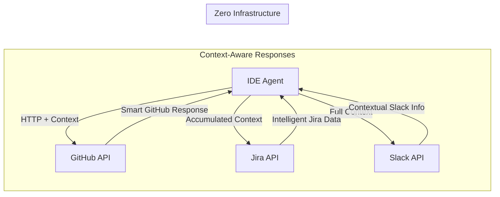

# Open Context Protocol (OCP)
## Zero-Infrastructure Context for AI Agents

> **"MCP without the servers. Context without the complexity."**

OCP enables AI agents to share context across API calls using standard HTTP headers. Built specifically for IDE coding assistants, DevOps agents, and agentic workflows.

## 🚀 Quick Start (IDE Agent)

```bash
# Current MCP setup in VS Code
{
  "mcp.servers": {
    "github": {"command": "node", "args": ["/path/to/github-mcp-server"]},
    "filesystem": {"command": "node", "args": ["/path/to/fs-mcp-server"]}
  }
}
# Result: 2 server processes, complex setup

# OCP setup in VS Code  
{
  "ocp.enabled": true,
  "github.token": "ghp_your_token"
}
# Result: Zero servers, direct API calls
```

## 🎯 The Agent Context Problem

**MCP Limitations for AI Agents**:
- ❌ Deploy custom servers for each integration
- ❌ MCP servers are stateless (no conversation memory)
- ❌ Complex JSON-RPC protocols between agent and server
- ❌ Server maintenance and versioning overhead
- ❌ Poor IDE integration experience

**OCP Solution**:
- ✅ Context flows in HTTP headers to existing APIs
- ✅ APIs become intelligent conversation participants  
- ✅ Persistent context across multi-step agent workflows
- ✅ Zero servers - agents call APIs directly
- ✅ Trivial IDE integration

## 🏗️ Agent-First Architecture



**Revolutionary Insight**: APIs become intelligent conversation participants when they receive agent context.

## 🤖 IDE Agent Example

### **Problem**: "Debug this failing test"

#### **MCP Flow** (Complex)
```
Agent → MCP Server → GitHub API → Generic Response → MCP Server → Agent
         ↑ (stateless, no conversation memory)
```

#### **OCP Flow** (Intelligent)  
```javascript
// Agent sends rich context to GitHub API
const context = {
  agent_goal: "debug_test_failure",
  current_file: "test_payment.py",
  test_error: "AssertionError: Expected 200, got 500",
  recent_changes: ["Modified payment_processor.py"]
};

// GitHub API gets context and responds intelligently
const response = await github.searchIssues("payment test failure", context);

// GitHub returns:
// - Issues specifically about payment tests
// - Related to files agent is working on  
// - Similar error patterns from context
// - Suggested debugging steps
```

**Result**: Agent gets targeted, intelligent responses instead of generic data.

## 🎯 Target Use Cases (Agent-First)

### **1. IDE Coding Assistants**
- **GitHub Copilot Chat** - Enhanced with conversation memory
- **Cursor AI** - Context-aware code suggestions  
- **Cody (Sourcegraph)** - Smarter code search and review
- **Replit Agent** - Intelligent project assistance

### **2. DevOps Agents**
- **Deployment Debugging** - Cross-service issue correlation
- **Infrastructure Monitoring** - Context-aware alert routing
- **CI/CD Optimization** - Intelligent pipeline suggestions

### **3. Customer Support Agents**
- **Issue Routing** - Context from user's recent actions
- **Knowledge Base** - Answers based on conversation history
- **Escalation Management** - Rich context for human agents

## ⚔️ vs MCP for Agents

| Feature | MCP | OCP 2.0 |
|---------|-----|---------|
| **Infrastructure** | Deploy custom servers | Zero servers |
| **Context Memory** | Stateless MCP servers | Persistent across calls |
| **Setup Complexity** | Server config + protocols | Add HTTP headers |
| **IDE Integration** | Complex server management | Simple token configuration |
| **Agent Performance** | Proxy server latency | Direct API calls |
| **API Intelligence** | Generic responses | Context-aware responses |
| **Conversation Flow** | Broken across calls | Continuous memory |
| **Debugging** | MCP protocol + HTTP | Standard HTTP only |

## 💡 Examples

### GitHub API (Zero Changes Required)
```python
import requests
import base64
import json

# Create OCP context
context = {
    "context_id": "github-session-123",
    "user": "alice",
    "session": {"history": []},
    "auth": {"tokens": {"github": "ghp_token"}}
}

# Add OCP headers to any GitHub API call
headers = {
    "Authorization": "token ghp_token",
    "OCP-Context-ID": context["context_id"],
    "OCP-Session": base64.b64encode(json.dumps(context).encode()).decode()
}

# Standard GitHub API calls now carry context
user = requests.get("https://api.github.com/user", headers=headers)
repos = requests.get("https://api.github.com/user/repos", headers=headers)
```

### AI Agent Integration
```python
from openai import OpenAI

class OCPAgent:
    def __init__(self):
        self.context = {"context_id": "ai-session", "history": []}
        
    def call_api(self, url, **kwargs):
        # Any HTTP API becomes OCP-enabled
        headers = kwargs.get('headers', {})
        headers.update(self.context_headers())
        return requests.get(url, headers=headers)
    
    def chat_with_tools(self, message):
        # AI can use any OpenAPI-defined tool
        tools = self.discover_tools_from_openapi()
        return self.llm.chat(message, tools=tools, context=self.context)
```

## 🚀 Getting Started

### 1. Try the CLI
```bash
# Create context
./tools/ocp-cli context create --user your-name

# Test with GitHub
./tools/ocp-cli github user --token YOUR_GITHUB_TOKEN

# Make raw HTTP calls
./tools/ocp-cli call GET https://api.github.com/user --context ocp-12345678
```

### 2. Add to Your API
```python
# Flask example
from flask import Flask, request, jsonify

app = Flask(__name__)

@app.route('/weather')
def get_weather():
    # Parse OCP context from headers
    context_id = request.headers.get('OCP-Context-ID')
    session_data = request.headers.get('OCP-Session')
    
    # Your existing logic
    weather = get_weather_data(request.args.get('location'))
    
    # Return data (context flows automatically in headers)
    return jsonify(weather)
```

### 3. Convert Existing OpenAPI
```bash
# Add OCP extensions to any OpenAPI spec
./tools/ocp-cli convert openapi https://api.github.com/openapi.json --output github-ocp.json
```

## 🎯 Benefits

### **For Developers**
- ✅ Use tools you already know (curl, Postman, OpenAPI generators)
- ✅ No new servers to deploy or maintain
- ✅ Standard HTTP debugging and monitoring
- ✅ Immediate ecosystem compatibility

### **For Enterprises**
- ✅ Zero additional infrastructure costs
- ✅ Use existing security and compliance policies
- ✅ Standard API gateway integration
- ✅ No vendor lock-in (pure HTTP/JSON)

### **For AI Applications**
- ✅ Every REST API becomes a potential tool
- ✅ Context flows seamlessly between services
- ✅ No proxy servers or middleware required
- ✅ Direct API calls = better performance

## 📊 vs MCP Comparison

| Feature | MCP | OCP 2.0 |
|---------|-----|---------|
| **Infrastructure** | Requires dedicated servers | Zero additional infrastructure |
| **Protocols** | Custom protocol format | Standard HTTP/REST |
| **Authentication** | Custom auth schemes | OAuth2/JWT/API keys |
| **Tool Definition** | Custom schema format | OpenAPI 3.x specs |
| **Ecosystem** | Limited tooling | Full HTTP ecosystem |
| **Learning Curve** | New concepts to learn | Use existing web standards |
| **Performance** | Proxy server overhead | Direct API calls |
| **Deployment** | Complex server setup | Add headers to existing APIs |

## 🛠️ Reference Implementations

### Python Library (Planned)
```python
pip install ocp-python
import ocp

context = ocp.Context(user="alice")
github = ocp.wrap_api("https://api.github.com", auth="token ghp_xxx")
user = github.get("/user", context=context)
```

### JavaScript Library (Planned)
```javascript
npm install ocp-js
import { OCP } from 'ocp-js';

const ocp = new OCP({user: 'alice'});
const response = await ocp.fetch('https://api.github.com/user', {
  auth: 'token ghp_xxx'
});
```

### Go Library (Planned)
```go
import "github.com/opencontextprotocol/ocp-go"

ctx := ocp.NewContext("alice")
client := ocp.NewHTTPClient(ctx)
resp, err := client.Get("https://api.github.com/user")
```

## 🤝 Contributing

1. **Add Examples**: Show how existing APIs work with OCP
2. **Build Tools**: Create libraries and utilities
3. **Write Docs**: Improve documentation and tutorials
4. **Test Integration**: Try with real-world APIs

## 📁 Repository Structure

```
├── SPECIFICATION.md                # Complete OCP specification
├── README.md                       # This file
├── ROADMAP.md                      # Public development roadmap
├── LICENSE                         # MIT License
├── CODE_OF_CONDUCT.md              # Community guidelines
├── schemas/                        # JSON schemas
│   ├── ocp-context.json            # Context object schema
│   └── ocp-openapi-extensions.json # OpenAPI extensions
├── examples/                       # Working examples
│   ├── github-api/                 # GitHub integration
│   └── stripe-api/                 # Payment processing
├── tools/                          # Reference implementations
│   ├── ocp-cli                     # Command line tool
│   └── ocp-validator               # Validation utilities
└── site/                           # Specification website (Hugo)
```

## 📄 License

MIT License - See [LICENSE](LICENSE)

---

**The goal**: Make AI context sharing as simple as adding HTTP headers to APIs you already have.

**No servers. No new protocols. Just standards.**