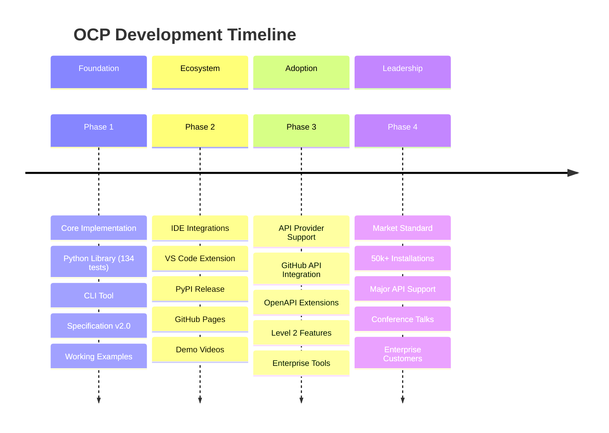

# Open Context Protocol (OCP) Roadmap

A zero-infrastructure protocol for AI agent context sharing across HTTP APIs.



---

## Current Status

**✅ Phase 1 Complete** - Core implementation finished with production-ready Python library, CLI tools, and comprehensive specification.

**🚀 Phase 2 Active** - Ecosystem expansion underway with IDE integrations and developer adoption focus.

---

## Phase 1: Foundation ✅ COMPLETED

### Core Implementation
- ✅ **OCP Specification v2.0** - Agent-focused protocol with Level 1/2 distinction
- ✅ **Python Library** - Complete implementation (134 tests, 86% coverage)
- ✅ **CLI Tool** - Context management and API testing
- ✅ **Working Examples** - GitHub and Stripe API integrations
- ✅ **Developer Tools** - Convenience functions and validation

### Key Features Delivered
```python
# Simple OCP agent setup
from ocp_agent import OCPAgent

agent = OCPAgent(agent_type="ide_assistant", workspace="my-project")
agent.register_api('github', 'https://api.github.com/rest/openapi.json')
response = agent.call_tool('listRepositoryIssues', {'owner': 'myorg', 'repo': 'myproject'})
```

---

## Phase 2: Ecosystem Expansion 🚀 IN PROGRESS

### Language Support (Foundation)
- [ ] **JavaScript/TypeScript Library** - `npm install @ocp/agent` (using Python lib as reference)
- [ ] **Go Library** - Server-side integrations
- [ ] **CLI Distribution** - Homebrew, package managers

### IDE Integrations (Requires JS Library)
- [ ] **VS Code Extension** - Context management using @ocp/agent library
- [ ] **Cursor AI Integration** - Native OCP support proposal
- [ ] **JetBrains Plugin** - IntelliJ, PyCharm integration

### Developer Adoption
- [ ] **PyPI Release** - `pip install open-context-agent` 
- [ ] **GitHub Pages** - Professional specification website
- [ ] **Getting Started Guide** - 5-minute setup tutorial
- [ ] **Demo Videos** - Show OCP advantages

**Target Metrics**:
- 1,000+ GitHub stars
- 500+ PyPI downloads  
- Working VS Code demo
- 5+ community integrations

---

## Phase 3: API Provider Adoption 🎯 PLANNED

### Major API Integrations
- [ ] **GitHub API** - Submit OCP support proposal
- [ ] **GitLab API** - Context-aware responses
- [ ] **Jira API** - Enhanced issue creation
- [ ] **Slack API** - Smart message suggestions

### Level 2 Features
- [ ] **Context-Aware APIs** - APIs that read and respond to OCP context
- [ ] **OpenAPI Extensions** - `x-ocp-enabled`, `x-ocp-context` specifications
- [ ] **Enhanced Examples** - Demonstrate Level 2 capabilities

**Target Metrics**:
- 2+ major APIs with Level 2 support
- 10,000+ active installations
- Conference presentation accepted

---

## Phase 4: Market Leadership 🏆 FUTURE

### Enterprise Features
- [ ] **Security Whitepaper** - Enterprise deployment guide
- [ ] **Compliance Tools** - SSO, audit logging, governance
- [ ] **Analytics Integration** - Usage tracking and optimization

### Agent Framework Integration
- [ ] **LangChain Tools** - Native OCP integration
- [ ] **OpenAI Assistants** - Enhanced assistant APIs
- [ ] **Anthropic Claude** - Context-aware conversations

### Community & Standards
- [ ] **Conference Talks** - DevToolsConf, AI Engineer Summit
- [ ] **Industry Blog Series** - Technical adoption guides
- [ ] **Standards Proposal** - Submit to relevant standards bodies

**Target Metrics**:
- 50,000+ active installations
- 10+ major APIs with native support
- Enterprise customers in production
- Industry recognition as standard

---

## Technical Advantages

| Feature | OCP | Traditional Approach |
|---------|-----|---------------------|
| **Setup Complexity** | Add HTTP headers | Configure servers/MCP |
| **Infrastructure** | Zero additional | Requires servers |
| **API Compatibility** | Works with any HTTP API | API-specific implementations |
| **Context Persistence** | Automatic across calls | Manual state management |
| **Performance** | Native HTTP speed | Additional network hops |
| **Security** | Standard HTTP security | Additional attack surface |

---

## Immediate Next Steps

### High Priority (This Month)
1. **JavaScript/TypeScript Library** - Port Python library to npm package
2. **PyPI Release** - Package and publish Python library
3. **Delete Current VS Code Extension** - Remove marketing garbage, start fresh
4. **GitHub Pages** - Professional specification website

### Medium Priority (Next Quarter)
5. **VS Code Extension v2** - Rebuild using @ocp/agent library (proper functionality)
6. **Demo Content** - Video showing OCP in action
7. **API Outreach** - Contact GitHub, GitLab teams
8. **Community Setup** - Discord, documentation, guides

### Future Considerations
9. **Conference Strategy** - Identify speaking opportunities
10. **Enterprise Planning** - Security and compliance roadmap
11. **Partnership Development** - Key integration targets

---

## Success Metrics by Phase

### Phase 2: Ecosystem (4 weeks)
- 📊 **Adoption**: 1K+ stars, 500+ downloads
- 🛠️ **Tools**: Working VS Code extension
- 🌐 **Community**: 5+ third-party integrations

### Phase 3: API Integration (12 weeks)  
- 🔗 **APIs**: 2+ with Level 2 OCP support
- 📈 **Scale**: 10K+ active installations
- 🎤 **Recognition**: Conference presentation

### Phase 4: Market Leader (6+ months)
- 🚀 **Adoption**: 50K+ installations
- 🏢 **Enterprise**: Production customers
- 🏆 **Standard**: Industry recognition

---

## Get Involved

**For Developers**:
- Try the [Python library](ocp-python/) with your APIs
- Build integrations for your favorite tools
- Contribute examples and documentation

**For API Providers**:
- Review the [specification](SPECIFICATION.md) 
- Consider Level 2 OCP support for enhanced responses
- Join the discussion on implementation strategies

**For Organizations**:
- Evaluate OCP for your AI agent workflows
- Provide feedback on enterprise requirements  
- Share your use cases and success stories

---

*Last updated: October 2025*