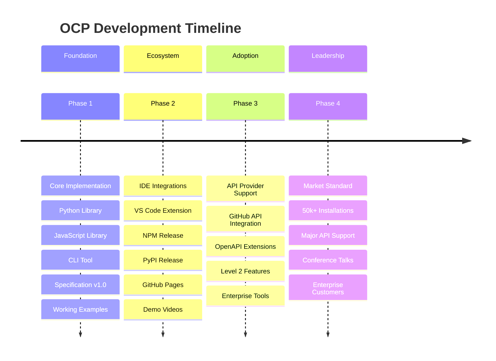

# Open Context Protocol (OCP) Roadmap

A zero-infrastructure protocol for AI agent context sharing across HTTP APIs.



---

## Current Status

**Phase 1: Foundation** - Core implementation with production-ready libraries, CLI tools, and comprehensive specification.

**Phase 2: Ecosystem** - IDE integration and developer adoption focus.

---

## Phase 1: Foundation

### Core Protocol & Libraries
- [ ] **OCP Specification v1.0** - Complete protocol definition with headers, context, validation
- [ ] **Python Library** - Full implementation with agent context, HTTP client, schema discovery
- [ ] **JavaScript Library** - TypeScript implementation with 1:1 Python parity
- [ ] **CLI Tools** - Discovery and testing utilities
- [ ] **Registry Service** - Community API registry

### Reference Implementation
- [ ] **Context Management** - Session persistence, goal tracking, interaction history
- [ ] **HTTP Integration** - Automatic header injection, response parsing
- [ ] **Schema Discovery** - OpenAPI parsing, tool validation
- [ ] **Authentication** - Secure parameter-based auth system

---

## Phase 2: Ecosystem

### IDE Integration
- [ ] **VS Code Extension** - Complete OCP integration with Language Model Tools API
  - Context management and API discovery
  - Tool calling with parameter validation
  - Authentication configuration
  - Cross-model compatibility (Claude, GPT)

### Publishing Pipeline
- [ ] **PyPI Release** - Publish Python library as `open-context-agent`
- [ ] **NPM Release** - Publish JavaScript library as `@opencontextprotocol/agent`
- [ ] **Package Management** - Proper dependency structure, versioning
- [ ] **GitHub Pages** - Professional specification website

### Core Implementation
- [x] **OCP Specification v2.0** - Agent-focused protocol with Level 1/2 distinction
- [x] **Python Library** - Complete implementation (145 tests, 100% passing)
- [x] **JavaScript/TypeScript Library** - Complete 1:1 parity (145 tests, 100% passing)
- [x] **CLI Tool** - Context management and API testing
- [x] **Registry** - Community API registry service
- [x] **Working Examples** - GitHub and Stripe API integrations
- [x] **Developer Tools** - Convenience functions and validation

### Key Features Delivered
```python
# Simple OCP agent setup
from ocp_agent import OCPAgent

agent = OCPAgent(agent_type="ide_assistant", workspace="my-project")
agent.register_api('github', 'https://api.github.com/rest/openapi.json')
response = agent.call_tool('listRepositoryIssues', {'owner': 'myorg', 'repo': 'myproject'})
```

---

## Phase 2: Ecosystem Expansion 🚀 IN PROGRESS

### Language Support (Foundation)
- [x] **JavaScript/TypeScript Library** - `npm install @opencontext/agent` (complete 1:1 parity with Python)
- [ ] **Go Library** - Server-side integrations
- [ ] **CLI Distribution** - Homebrew, package managers

### IDE Integrations (Requires JS Library)
- [ ] **VS Code Extension** - Context management using @opencontext/agent library (IN PROGRESS)
- [ ] **Cursor AI Integration** - Native OCP support proposal
- [ ] **JetBrains Plugin** - IntelliJ, PyCharm integration

### Developer Adoption
- [ ] **PyPI Release** - `pip install open-context-agent` 
- [ ] **GitHub Pages** - Professional specification website
- [ ] **Getting Started Guide** - 5-minute setup tutorial
- [ ] **Demo Videos** - Show OCP advantages

**Target Metrics**:
- 1,000+ GitHub stars
- 500+ PyPI downloads  
- Working VS Code demo
- 5+ community integrations

---

## Phase 3: API Provider Adoption 🎯 PLANNED

### Major API Integrations
- [ ] **GitHub API** - Submit OCP support proposal
- [ ] **GitLab API** - Context-aware responses
- [ ] **Jira API** - Enhanced issue creation
- [ ] **Slack API** - Smart message suggestions

### Level 2 Features
- [ ] **Context-Aware APIs** - APIs that read and respond to OCP context
- [ ] **OpenAPI Extensions** - `x-ocp-enabled`, `x-ocp-context` specifications
- [ ] **Enhanced Examples** - Demonstrate Level 2 capabilities

**Target Metrics**:
- 2+ major APIs with Level 2 support
- 10,000+ active installations
- Conference presentation accepted

---

## Phase 4: Market Leadership 🏆 FUTURE

### Enterprise Features
- [ ] **Security Whitepaper** - Enterprise deployment guide
- [ ] **Compliance Tools** - SSO, audit logging, governance
- [ ] **Analytics Integration** - Usage tracking and optimization

### Agent Framework Integration
- [ ] **LangChain Tools** - Native OCP integration
- [ ] **OpenAI Assistants** - Enhanced assistant APIs
- [ ] **Anthropic Claude** - Context-aware conversations

### Community & Standards
- [ ] **Conference Talks** - DevToolsConf, AI Engineer Summit
- [ ] **Industry Blog Series** - Technical adoption guides
- [ ] **Standards Proposal** - Submit to relevant standards bodies

**Target Metrics**:
- 50,000+ active installations
- 10+ major APIs with native support
- Enterprise customers in production
- Industry recognition as standard

---

## Technical Advantages

| Feature | OCP | Traditional Approach |
|---------|-----|---------------------|
| **Setup Complexity** | Add HTTP headers | Configure servers/MCP |
| **Infrastructure** | Zero additional | Requires servers |
| **API Compatibility** | Works with any HTTP API | API-specific implementations |
| **Context Persistence** | Automatic across calls | Manual state management |
| **Performance** | Native HTTP speed | Additional network hops |
| **Security** | Standard HTTP security | Additional attack surface |

---

## Immediate Next Steps

### Phase 1 Completion
- [ ] **Python Library Testing** - Final validation and package preparation
- [ ] **JavaScript Library Testing** - Complete test suite validation
- [ ] **PyPI Publishing** - Release Python library to public package index
- [ ] **NPM Publishing** - Release JavaScript library to public package index

### Phase 2 Initiation  
- [ ] **VS Code Extension** - Complete development and testing
- [ ] **Documentation Site** - Professional GitHub Pages deployment
- [ ] **Demo Content** - Video demonstrations of OCP workflow
- [ ] **Community Setup** - Documentation, examples, and guides

### Phase 3 Preparation
- [ ] **API Outreach** - Engage with GitHub, GitLab teams
- [ ] **Enterprise Validation** - Test with development teams
- [ ] **Performance Optimization** - Benchmark and optimize for scale
- [ ] **Conference Strategy** - Identify speaking opportunities

---

## Success Metrics by Phase

### Phase 1: Foundation
- **Technical**: Core libraries with comprehensive test coverage
- **Quality**: Clean APIs with complete documentation
- **Publishing**: Packages available on PyPI and NPM
- **Validation**: Working examples and CLI tools

### Phase 2: Ecosystem
- **Adoption**: 1K+ stars, 500+ downloads
- **Tools**: Working VS Code extension
- **Community**: 5+ third-party integrations
- **Content**: Professional documentation and demos

### Phase 3: API Integration
- **APIs**: 2+ with Level 2 OCP support
- **Scale**: 10K+ active installations
- **Recognition**: Conference presentation
- **Enterprise**: Pilot customers

### Phase 4: Market Leader
- **Adoption**: 50K+ installations
- **Enterprise**: Production customers
- **Standard**: Industry recognition
- **Ecosystem**: Major API provider adoption

---

## Get Involved

**For Developers**:
- Try the [Python library](ocp-python/) with your APIs
- Build integrations for your favorite tools
- Contribute examples and documentation

**For API Providers**:
- Review the [specification](SPECIFICATION.md) 
- Consider Level 2 OCP support for enhanced responses
- Join the discussion on implementation strategies

**For Organizations**:
- Evaluate OCP for your AI agent workflows
- Provide feedback on enterprise requirements  
- Share your use cases and success stories

---

*Last updated: November 2025*