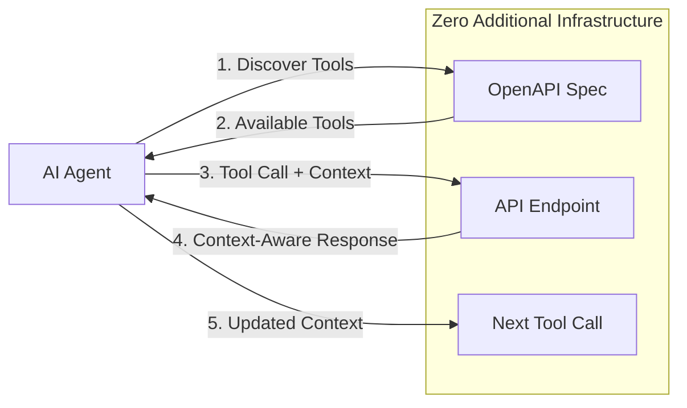

# Open Context Protocol (OCP)
## Context-Aware API Integration for AI Agents

**TL;DR**: OCP enables persistent context sharing across HTTP API calls using standard headers, with automatic API discovery from OpenAPI specifications - no servers or infrastructure required.

---

## The AI Agent Integration Challenge

**Current Limitations**:
- Agents lose context between API calls
- Manual integration for each API service
- Complex server infrastructure for simple context passing
- No standard way to share conversation state
- Fragmented tooling across different APIs

**OCP's Approach**:
- ✅ **API Discovery**: Auto-generate tools from OpenAPI specifications
- ✅ **Tool Invocation**: Call any API operation with parameter validation
- ✅ **Context Management**: Persistent context across all interactions  
- ✅ **Zero Infrastructure**: No servers, just standard HTTP headers
- ✅ **Standards-Based**: Built on HTTP, OpenAPI, and JSON

---

## Core OCP Capabilities

OCP provides a complete framework for context-aware API integration:

**API Integration**:
- Automatic tool discovery from OpenAPI specifications
- Parameter validation and request building
- Structured request/response handling

**Context Intelligence**:
- Persistent context across tool calls
- Conversation state management
- Session tracking and interaction history
- Automatic context injection via HTTP headers

### The Agent Tool Flow:


**Key Insight**: Agents discover tools dynamically AND maintain context across calls.

---

## Core OCP Components

OCP consists of two fundamental capabilities that work together:

### 1. **Context Management** (Header-Based)
Smart context injection into existing HTTP APIs using standard headers. Enables persistent conversation state and session tracking across API calls.

### 2. **Schema Discovery** (OpenAPI-Based)  
Automatic API tool discovery and invocation from OpenAPI specifications. Converts any OpenAPI-documented API into callable tools with parameter validation.

**Together**: Context + Discovery = Complete agent-ready API integration with zero infrastructure.

---

## Context Management: Smart HTTP Headers

### **Agent Context Object**
```json
{
  "context_id": "agent-session-123",
  "agent_type": "ide_coding_assistant",
  "agent_goal": "debug_deployment_failure",
  "user": "alice",
  "workspace": {
    "name": "payment-service",
    "language": "python",
    "current_file": "deployment.py"
  },
  "conversation": {
    "history": [
      {"role": "user", "content": "My deployment is failing"},
      {"role": "assistant", "content": "Let me check your GitHub workflows"}
    ]
  },
  "accumulated_context": {
    "github_repos": ["payment-service"],
    "recent_deployments": [{"status": "failed", "error": "permission_denied"}],
    "investigation_focus": "github_actions_permissions"
  }
}
```

### 2. **Context-Aware API Calls**
```http
GET /repos/alice/payment-service/actions/runs HTTP/1.1
Host: api.github.com
Authorization: token ghp_xxxxxxxxxxxx
OCP-Context-ID: agent-session-123
OCP-Agent-Type: ide_coding_assistant
OCP-Agent-Goal: debug_deployment_failure
OCP-Session: eyJhZ2VudF9nb2FsIjoiZGVidWdfZGVwbG95bWVudF9mYWlsdXJlIn0=
```

### 3. **Enhanced API Responses**
```json
{
  "workflow_runs": [
    {
      "id": 123456,
      "status": "failure",
      "conclusion": "failure",
      "permissions_analysis": {     // ← Added because context shows permission debugging
        "missing": ["secrets:write", "contents:write"],
        "suggested_fix": "Add permissions to workflow file"
      },
      "similar_failures": [         // ← Related failures based on context
        {"repo": "other-service", "fix": "Updated GITHUB_TOKEN permissions"}
      ]
    }
  ]
}
```

---

## IDE Integration Example

### **Context-Aware Debugging Workflow**

**Scenario**: Developer asks IDE agent "This test is failing, help me debug it"

#### OCP-Enhanced Flow:
```javascript
// Agent builds rich context from IDE state + conversation
const context = {
  agent_goal: "debug_test_failure",
  current_file: "test_payment.py", 
  test_name: "test_process_refund",
  error_message: "AssertionError: Expected 200, got 500",
  recent_git_activity: ["Modified payment_processor.py"],
  conversation_context: "user_asked_about_failing_test"
};

// Direct GitHub API call with context
const response = await fetch('https://api.github.com/search/issues', {
  headers: {
    'Authorization': 'token ghp_xxx',
    'OCP-Context-ID': 'debug-session-456',
    'OCP-Agent-Goal': 'debug_test_failure',
    'OCP-Session': base64(JSON.stringify(context))
  },
  params: {q: 'repo:myproject payment test failure'}
});
```

**GitHub API Response (OCP-Enhanced)**:
```json
{
  "items": [
    {
      "number": 89,
      "title": "Payment test intermittently fails with 500 error",
      "test_context_match": true,        // ← Knows this is about test debugging
      "related_files": ["payment_processor.py", "test_payment.py"],
      "similar_error_patterns": ["AssertionError", "500 status"],
      "suggested_investigation": [       // ← Smart suggestions based on context
        "Check payment_processor.py recent changes",
        "Verify test database setup",
        "Review payment service logs"
      ]
    }
  ]
}
```

**Agent Response**: "I found a similar issue (#89) with the same error pattern. Based on your recent changes to payment_processor.py, try checking the database connection in your test setup."

---

## Schema Discovery: API Tool Generation

### **Automatic Tool Discovery from OpenAPI**
OCP automatically converts OpenAPI specifications into callable tools for AI agents:

```python
from ocp import OCPAgent

# Create agent with context
agent = OCPAgent(
    agent_type="api_explorer",
    workspace="my-project"
)

# Register GitHub API (auto-discovers tools)
api_spec = agent.register_api('github', 'https://api.github.com/rest/openapi.json')

# List available tools
tools = agent.list_tools('github')
print(f"Discovered {len(tools)} tools")

# Search for specific tools
issue_tools = agent.search_tools('create issue')

# Call tools with automatic context injection
response = agent.call_tool('createIssue', {
    'owner': 'myorg',
    'repo': 'myproject', 
    'title': 'Bug found in payment flow',
    'body': 'Discovered during debugging session'
})
```

### **Tool Schema Generation**
Each OpenAPI operation becomes a callable tool with full parameter validation:

```python
# Tool generated from OpenAPI operation
{
    'name': 'createIssue',
    'description': 'Create an issue',
    'method': 'POST',
    'path': '/repos/{owner}/{repo}/issues',
    'parameters': {
        'owner': {'type': 'string', 'required': True, 'location': 'path'},
        'repo': {'type': 'string', 'required': True, 'location': 'path'},
        'title': {'type': 'string', 'required': True, 'location': 'body'},
        'body': {'type': 'string', 'required': False, 'location': 'body'},
        'labels': {'type': 'array', 'required': False, 'location': 'body'}
    },
    'response_schema': {...}  # OpenAPI response schema
}
```

### **Context + Discovery Integration**
Schema discovery works seamlessly with context management:

```python
from ocp import OCPAgent

# Create agent with integrated context and discovery
agent = OCPAgent(
    agent_type="ide_coding_assistant",
    user="alice",
    workspace="payment-service"
)

# Register APIs (auto-discovers tools)
agent.register_api('github', 'https://api.github.com/rest/openapi.json')
agent.register_api('jira', 'https://mycompany.atlassian.net/rest/api/openapi.json')

# Agent can now:
# 1. Discover available tools across all APIs
# 2. Call tools with rich context automatically injected
# 3. Maintain conversation state across tool calls
# 4. Provide intelligent suggestions based on context

tools = agent.search_tools('create issue')  # Find issue creation across APIs
result = agent.call_tool('createIssue', params)  # Auto-adds context headers
```

### **Deterministic Tool Naming**
OCP ensures predictable tool names for consistent agent behavior:

```python
# Tool naming follows deterministic rules:
# 1. Use operationId when present in OpenAPI spec
{
    "operationId": "listRepositories",  # → Tool name: "listRepositories"
    "operationId": "createIssue"        # → Tool name: "createIssue"
}

# 2. Generate from HTTP method + path when operationId missing
{
    "GET /items":     # → Tool name: "get_items"
    "POST /items":    # → Tool name: "post_items"  
    "GET /items/{id}" # → Tool name: "get_items_id"
}

# This ensures:
# - Agents can reliably reference tools across sessions
# - Tool names remain consistent across API spec updates
# - Integration scripts don't break due to name changes
```

---

## OpenAPI Integration Levels

### **Level 1: Standard OpenAPI (Works Today)**
OCP works immediately with any existing OpenAPI specification:

```python
from ocp import OCPAgent

# Works with GitHub's existing OpenAPI spec
agent = OCPAgent(
    agent_type="api_client",
    user="alice"
)
agent.register_api('github', 'https://api.github.com/rest/openapi.json')

# All GitHub API operations become available as tools
response = agent.call_tool('listUserRepos', {'username': 'octocat'})
```

### **Level 2: OCP-Enhanced OpenAPI (Future)**
APIs can optionally add OCP extensions to their OpenAPI specs to provide smarter responses:

```yaml
# Enhanced GitHub OpenAPI spec (future)
openapi: 3.0.0
info:
  title: GitHub API
  version: 3.0.0
  x-ocp-enabled: true              # This API can read OCP context

paths:
  /repos/{owner}/{repo}/issues:
    post:
      summary: Create an issue
      x-ocp-context:                # OCP behavior for this operation
        enhances_with:
          - agent_goal              # Use agent goal to customize response
          - workspace_context       # Use workspace info for smarter defaults
          - conversation_history    # Use chat history for better issue descriptions
      responses:
        201:
          description: Issue created
          x-ocp-enhanced-response:  # What gets added when OCP context is present
            properties:
              suggested_labels:     # Auto-suggest labels based on context
                type: array
              related_issues:       # Find related issues based on context
                type: array
              next_actions:         # Suggest follow-up actions
                type: array
```

### **Discovery Mechanism**
Agents discover OCP capabilities through standard OpenAPI specs:

```python
import requests
from ocp import OCPAgent

# Check if API supports OCP (future enhancement)
spec = requests.get('https://api.github.com/rest/openapi.json').json()
ocp_enabled = spec.get('info', {}).get('x-ocp-enabled', False)

agent = OCPAgent(agent_type="api_client")

if ocp_enabled:
    # API will provide enhanced responses with OCP context
    agent.register_api('github', 'https://api.github.com/rest/openapi.json')
else:
    # Standard API calls (still works!)
    # Context managed client-side only
    agent.register_api('github', 'https://api.github.com/rest/openapi.json')
```

### **Key Points**:
1. **No special discovery endpoint needed** - Uses existing OpenAPI specs
2. **Backward compatible** - OCP-unaware clients work normally  
3. **Standards-based** - Just extensions to existing OpenAPI format
4. **Optional** - APIs can add OCP extensions gradually

---

## OCP Extensions to OpenAPI

Add these optional extensions to your OpenAPI specs:

```yaml
info:
  x-ocp-enabled: true           # This API supports OCP
  x-ocp-context-aware: true     # This API can use context

paths:
  /weather:
    get:
      x-ocp-context:
        requires: ["location"]   # Needs location from context
        provides: ["weather"]    # Adds weather to context
        preserves: ["user_prefs"] # Passes through user preferences
```

---

## API Registration & Discovery Process

When agents register APIs with OCP, the following standardized process occurs:

### **1. Fetch OpenAPI Specification**
```python
# Agent requests OpenAPI spec from provided URL
api_spec = agent.register_api('github', 'https://api.github.com/rest/openapi.json')
# Internally fetches and parses the OpenAPI specification
```

### **2. Parse Operations into Tools**
```python
# Each OpenAPI operation becomes a callable tool
# (This happens automatically in agent.register_api())

# Example of generated tool structure:
tool = {
    'name': operation.get('operationId') or generate_tool_name(method, path),
    'description': operation.get('summary') or operation.get('description'),
    'method': method.upper(),
    'path': path,
    'parameters': parse_parameters(operation.get('parameters', [])),
    'response_schema': operation.get('responses', {}).get('200', {}).get('content', {}).get('application/json', {}).get('schema')
}
```

### **3. Store for Agent Context**
```python
# Add API spec to agent's context for persistent access
# (This happens automatically in agent.register_api())

# Discovery results are logged in context
agent.context.add_interaction(
    'api_registered',
    'https://api.github.com/rest/openapi.json', 
    f'Discovered {len(tools)} tools'
)
```

### **4. Enable Tool Invocation**
```python
# Tools become immediately available for agent use
response = agent.call_tool('listRepositoryIssues', {
    'owner': 'myorg',
    'repo': 'myproject'
})
# Context headers automatically added to HTTP request
```

This process ensures **deterministic behavior**, **consistent tool availability**, and **automatic context enhancement** across all API interactions.

---

## Client Library Design Philosophy

**Protocol-Only Specification**: This specification defines the HTTP protocol layer only. OCP focuses on standardizing how context flows between agents and APIs via HTTP headers, not how client libraries should be structured.

**Core Requirements**: All OCP client libraries must provide:
1. **Context Management**: Create, update, and inject OCP context headers
2. **Schema Discovery**: Parse OpenAPI specs and generate callable tools
3. **Tool Invocation**: Execute API operations with automatic context injection
4. **Parameter Validation**: Validate tool parameters against OpenAPI schemas

**Reference Implementation Testing Standards**: To ensure reliability and specification compliance, OCP client libraries should include comprehensive test coverage:

### **Required Test Categories**:
- **Context Management**: 100% coverage for context creation, updates, and serialization
- **Schema Discovery**: Deterministic tool name generation and OpenAPI parsing validation
- **HTTP Enhancement**: Header encoding/decoding with compression and error handling
- **Agent Orchestration**: Complete workflow testing from API registration to tool execution

### **Test Quality Requirements**:
```python
# Example: Deterministic tool naming validation
def test_tool_naming_consistency():
    agent = OCPAgent(agent_type="test_agent")
    
    # Register API twice and ensure consistent tool names
    spec1 = agent.register_api("test", "test-api.json")
    tools1 = agent.list_tools("test")
    
    # Clear and re-register
    agent = OCPAgent(agent_type="test_agent")
    spec2 = agent.register_api("test", "test-api.json") 
    tools2 = agent.list_tools("test")
    
    # Tools must have predictable names
    assert "get_items" in [t.name for t in tools1]      # GET /items
    assert "post_items" in [t.name for t in tools1]     # POST /items  
    assert "get_items_id" in [t.name for t in tools1]   # GET /items/{id}
    
    # Names must be stable across repeated registration
    assert [t.name for t in tools1] == [t.name for t in tools2]
```

This ensures **predictable behavior**, **reliable integrations**, and **consistent developer experience** across different OCP client implementations.

**Language-Idiomatic Implementations**: Client libraries should follow idiomatic patterns for their respective languages while correctly implementing the OCP HTTP protocol. This approach:

- Enables **natural APIs** for each programming language
- Encourages **innovation** in client design patterns  
- Reduces **adoption friction** by feeling familiar to developers
- Ensures **interoperability** through the shared HTTP protocol

**Examples of Acceptable Variance**:
- Method names: `register_api()` vs `add_service()` vs `discover_tools()`
- Class structure: `OCPAgent` vs `AgentContext` vs functional approaches
- Async patterns: Promises vs Futures vs async/await
- Error handling: Exceptions vs Result types vs error callbacks

**What Must Be Consistent**:
- HTTP header format (`OCP-Context-ID`, `OCP-Session`, etc.)
- Context object JSON schema
- Base64 encoding and compression rules
- OpenAPI parsing and tool generation
- Tool invocation parameter mapping

---

## Implementation Examples

### 1. Agent with Schema Discovery
```python
from ocp import OCPAgent

# Create agent with context
agent = OCPAgent(
    agent_type="ide_coding_assistant",
    user="alice", 
    workspace="payment-service"
)

# Register APIs (automatically discovers tools)
agent.register_api('github', 'https://api.github.com/rest/openapi.json')
agent.register_api('jira', 'https://company.atlassian.net/openapi.json')

# Discover available tools
tools = agent.list_tools()
print(f"Discovered {len(tools)} tools across all APIs")

# Search for specific capabilities
issue_tools = agent.search_tools('create issue')

# Call tools with automatic context injection
response = agent.call_tool('createIssue', {
    'owner': 'myorg',
    'repo': 'payment-service',
    'title': 'Payment processing bug',
    'body': 'Found during debugging session'
})
```

### 2. Wrap Any OpenAPI Service
```python
from ocp import OCPAgent, wrap_api

# Create agent
agent = OCPAgent(
    agent_type="weather_client", 
    user="alice"
)

# Create context-aware HTTP client for any API
weather_client = wrap_api(
    "https://weather-api.com",
    agent.context,
    auth="api_key your_key_here"
)

# Make context-aware API calls
result = weather_client.get("/weather", params={"location": "NYC"})
```

### 3. Add OCP to Existing API
```python
from flask import Flask, request
from ocp import parse_context, add_context_headers

app = Flask(__name__)

@app.route('/weather')
def get_weather():
    # Parse OCP context from headers
    context = parse_context(request.headers)
    
    # Your existing logic
    weather = fetch_weather(request.args.get('location'))
    
    # Add context to response
    response = make_response(weather)
    add_context_headers(response, context)
    return response
```

### 3. AI Agent with OCP
```python
class WeatherAgent:
    def __init__(self):
        self.context = OCPContext()
        
    def get_weather(self, location):
        # Standard HTTP call with OCP headers
        response = requests.get(
            'https://weather-api.com/weather',
            params={'location': location},
            headers=self.context.to_headers()
        )
        
        # Update context from response
        self.context.update_from_headers(response.headers)
        return response.json()
```

---

---

## Getting Started

### 1. Add OCP Headers to Existing API
```javascript
// Express.js example
app.use((req, res, next) => {
  // Parse OCP context if present
  if (req.headers['ocp-context-id']) {
    req.ocp_context = parseOCPHeaders(req.headers);
  }
  next();
});

app.get('/weather', (req, res) => {
  const weather = getWeather(req.query.location);
  
  // Add OCP headers to response
  if (req.ocp_context) {
    res.set('OCP-Context-ID', req.ocp_context.id);
    res.set('OCP-Session', encodeContext(req.ocp_context));
  }
  
  res.json(weather);
});
```

### 2. Use Existing APIs with OCP
```python
from ocp import AgentContext, wrap_api

# Create context
context = AgentContext(
    agent_type="api_client",
    user="alice"
)

# Create context-aware HTTP client
github_client = wrap_api(
    "https://api.github.com",
    context,
    auth="token ghp_xxx"
)

# Make API calls with automatic context headers
response = github_client.get("/user")

# Context automatically flows between calls
repos = github_client.get("/user/repos")
# Same context, accumulated state
```

### 3. Enable AI Agents
```python
from openai import OpenAI
from ocp import OCPAgent

client = OpenAI()

# Create agent with context
agent = OCPAgent(
    agent_type="ai_assistant",
    user="alice"
)

# Register multiple APIs
agent.register_api('weather', 'https://weather-api.com/openapi.json')
agent.register_api('calendar', 'https://calendar-api.com/openapi.json')

# Get available tools for LLM function calling
tools = agent.list_tools()

response = client.chat.completions.create(
    model="gpt-4",
    messages=[{"role": "user", "content": "What's the weather in NYC?"}],
    tools=[{
        "type": "function",
        "function": {
            "name": tool.name,
            "description": tool.description,
            "parameters": tool.parameters
        }
    } for tool in tools]
)

# Execute tool calls with OCP context
if response.choices[0].message.tool_calls:
    for tool_call in response.choices[0].message.tool_calls:
        result = agent.call_tool(tool_call.function.name, tool_call.function.arguments)
```

---

## Specification Status

**Current Version**: 1.0  
**Status**: Draft  
**License**: MIT  

### Contributing
1. Add examples to `examples/` directory
2. Submit OpenAPI extensions to `schemas/`
3. Build reference implementations in `tools/`
4. Create migration guides in `docs/migration/`

### Reference Implementations
- Python: `ocp-python` (planned)
- JavaScript: `ocp-js` (planned)  
- Go: `ocp-go` (planned)
- CLI: `ocp-cli` (planned)

---

**The goal**: Make AI context sharing as simple as adding HTTP headers to APIs you already have.

**No servers. No new protocols. Just standards.**