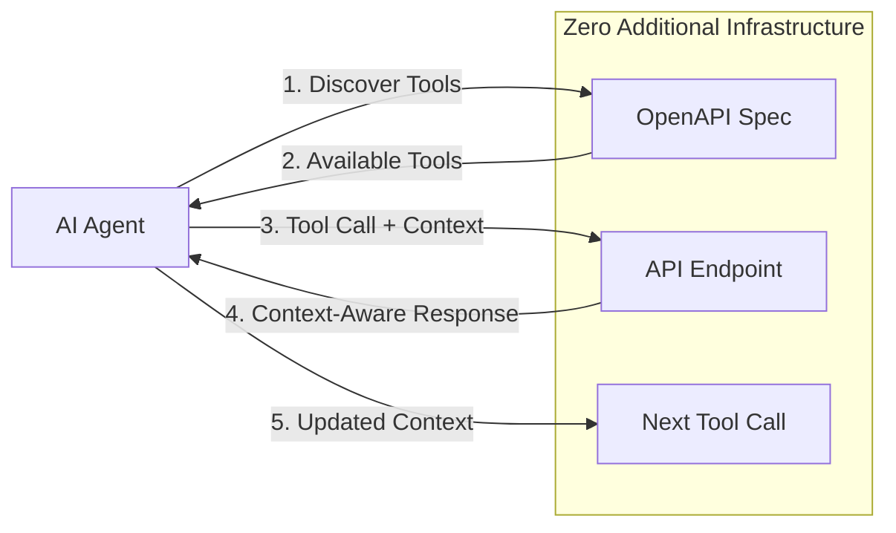

# Open Context Protocol (OCP)
## Complete MCP Alternative with Zero Infrastructure

**TL;DR**: OCP provides everything MCP does (API discovery, tool invocation, parameter validation) PLUS persistent context management, all with zero servers and standard HTTP.

---

## The AI Agent Context Problem

**Current State with MCP**:
- ❌ Deploy custom MCP servers for each integration
- ❌ Learn new protocol schemas and JSON-RPC
- ❌ Maintain server infrastructure for simple context passing
- ❌ Stateless MCP servers lose conversation memory
- ❌ Complex setup kills adoption in IDEs

**OCP's Complete Solution**:
- ✅ **API Discovery**: Auto-generate tools from OpenAPI specs
- ✅ **Tool Invocation**: Call any API operation with validation
- ✅ **Context Management**: Persistent context across interactions  
- ✅ **Zero Infrastructure**: No servers, just standard HTTP
- ✅ **IDE Integration**: Trivial setup compared to MCP

---

## Core Principle: MCP Features + Context Intelligence

OCP provides complete feature parity with MCP while adding persistent context management:

**MCP Capabilities (Provided by OCP)**:
- ✅ API discovery from specifications
- ✅ Tool invocation with parameter validation
- ✅ Structured request/response handling

**OCP Advantages (Not in MCP)**:
- ✅ Persistent context across tool calls
- ✅ Zero server infrastructure required
- ✅ Standard HTTP protocol only
- ✅ Automatic context injection

### The Agent Tool Flow:


**Key Insight**: Agents discover tools dynamically AND maintain context across calls.

---

## Core OCP Components

OCP provides two fundamental capabilities that together create a complete MCP alternative:

### 1. **Context Management** (Header-Based)
Smart context injection into existing HTTP APIs using standard headers.

### 2. **Schema Discovery** (OpenAPI-Based)  
Automatic API tool discovery and invocation from OpenAPI specifications.

**Together**: Context + Discovery = Complete agent-ready API integration with zero infrastructure.

---

## Context Management: Smart HTTP Headers

### **Agent Context Object**
```json
{
  "context_id": "agent-session-123",
  "agent_type": "ide_coding_assistant",
  "agent_goal": "debug_deployment_failure",
  "user": "alice",
  "workspace": {
    "name": "payment-service",
    "language": "python",
    "current_file": "deployment.py"
  },
  "conversation": {
    "history": [
      {"role": "user", "content": "My deployment is failing"},
      {"role": "assistant", "content": "Let me check your GitHub workflows"}
    ]
  },
  "accumulated_context": {
    "github_repos": ["payment-service"],
    "recent_deployments": [{"status": "failed", "error": "permission_denied"}],
    "investigation_focus": "github_actions_permissions"
  }
}
```

### 2. **Context-Aware API Calls**
```http
GET /repos/alice/payment-service/actions/runs HTTP/1.1
Host: api.github.com
Authorization: token ghp_xxxxxxxxxxxx
OCP-Context-ID: agent-session-123
OCP-Agent-Type: ide_coding_assistant
OCP-Agent-Goal: debug_deployment_failure
OCP-Session: eyJhZ2VudF9nb2FsIjoiZGVidWdfZGVwbG95bWVudF9mYWlsdXJlIn0=
```

### 3. **Enhanced API Responses**
```json
{
  "workflow_runs": [
    {
      "id": 123456,
      "status": "failure",
      "conclusion": "failure",
      "permissions_analysis": {     // ← Added because context shows permission debugging
        "missing": ["secrets:write", "contents:write"],
        "suggested_fix": "Add permissions to workflow file"
      },
      "similar_failures": [         // ← Related failures based on context
        {"repo": "other-service", "fix": "Updated GITHUB_TOKEN permissions"}
      ]
    }
  ]
}
```

---

## Primary Use Case: IDE Coding Agents

### **VS Code Copilot Chat** Enhanced with OCP

#### Current MCP Setup (Complex):
```json
{
  "mcp.servers": {
    "github": {"command": "node", "args": ["/path/to/github-mcp-server"]},
    "filesystem": {"command": "node", "args": ["/path/to/fs-mcp-server"]}
  }
}
```
**Result**: 2 server processes, custom protocols, stateless interactions

#### OCP Setup (Simple):
```json
{
  "ocp.enabled": true,
  "github.token": "ghp_xxx"
}
```
**Result**: Zero servers, direct API calls, persistent context

### **Agent Conversation Example**

**User**: "This test is failing, help me debug it"

#### MCP Flow:
```
User → Copilot → MCP Server → GitHub API → Response Chain
              ↑ (stateless server, no memory of previous conversation)
```

#### OCP Flow:
```javascript
// Agent builds rich context from IDE state + conversation
const context = {
  agent_goal: "debug_test_failure",
  current_file: "test_payment.py", 
  test_name: "test_process_refund",
  error_message: "AssertionError: Expected 200, got 500",
  recent_git_activity: ["Modified payment_processor.py"],
  conversation_context: "user_asked_about_failing_test"
};

// Direct GitHub API call with context
const response = await fetch('https://api.github.com/search/issues', {
  headers: {
    'Authorization': 'token ghp_xxx',
    'OCP-Context-ID': 'debug-session-456',
    'OCP-Agent-Goal': 'debug_test_failure',
    'OCP-Session': base64(JSON.stringify(context))
  },
  params: {q: 'repo:myproject payment test failure'}
});
```

**GitHub API Response (OCP-Enhanced)**:
```json
{
  "items": [
    {
      "number": 89,
      "title": "Payment test intermittently fails with 500 error",
      "test_context_match": true,        // ← Knows this is about test debugging
      "related_files": ["payment_processor.py", "test_payment.py"],
      "similar_error_patterns": ["AssertionError", "500 status"],
      "suggested_investigation": [       // ← Smart suggestions based on context
        "Check payment_processor.py recent changes",
        "Verify test database setup",
        "Review payment service logs"
      ]
    }
  ]
}
```

**Agent Response**: "I found a similar issue (#89) with the same error pattern. Based on your recent changes to payment_processor.py, try checking the database connection in your test setup."

---

## Schema Discovery: API Tool Generation

### **Automatic Tool Discovery from OpenAPI**
OCP automatically converts OpenAPI specifications into callable tools for AI agents:

```javascript
// Agent discovers GitHub API capabilities
const ocpClient = new OCPClient();
await ocpClient.registerAPI('github', 'https://api.github.com/rest/openapi.json');

// List available tools
const tools = ocpClient.listTools('github');
console.log(tools.map(t => `${t.name}: ${t.description}`));
// Output:
// createIssue: Create a new issue in a repository
// getRepository: Get repository information
// listBranches: List branches in a repository
// ...

// Call tools with automatic context injection
const issue = await ocpClient.callTool('createIssue', {
  owner: 'myorg',
  repo: 'myproject', 
  title: 'Bug found in payment flow',
  body: 'Discovered during debugging session'
});
```

### **Tool Schema Generation**
Each OpenAPI operation becomes a callable tool with full parameter validation:

```javascript
// Tool generated from OpenAPI operation
{
  name: 'createIssue',
  description: 'Create an issue',
  method: 'POST',
  path: '/repos/{owner}/{repo}/issues',
  parameters: {
    owner: { type: 'string', required: true, location: 'path' },
    repo: { type: 'string', required: true, location: 'path' },
    title: { type: 'string', required: true, location: 'body' },
    body: { type: 'string', required: false, location: 'body' },
    labels: { type: 'array', required: false, location: 'body' }
  },
  responseSchema: { /* OpenAPI response schema */ }
}
```

### **Context + Discovery Integration**
Schema discovery works seamlessly with context management:

```javascript
// Single client provides both capabilities
const agent = new OCPAgent(context);

// Register APIs (auto-discovers tools)
await agent.registerAPI('github', 'https://api.github.com/rest/openapi.json');
await agent.registerAPI('jira', 'https://mycompany.atlassian.net/rest/api/openapi.json');

// Agent can now:
// 1. Discover available tools across all APIs
// 2. Call tools with rich context automatically injected
// 3. Maintain conversation state across tool calls
// 4. Provide intelligent suggestions based on context

const tools = agent.searchTools('create issue');  // Find issue creation across APIs
const result = await agent.callTool('createIssue', params);  // Auto-adds context headers
```

### **Deterministic Tool Naming**
OCP ensures predictable tool names for consistent agent behavior:

```javascript
// Tool naming follows deterministic rules:
// 1. Use operationId when present in OpenAPI spec
{
  "operationId": "listRepositories",  // → Tool name: "listRepositories"
  "operationId": "createIssue"        // → Tool name: "createIssue"
}

// 2. Generate from HTTP method + path when operationId missing
{
  "GET /items":     // → Tool name: "get_items"
  "POST /items":    // → Tool name: "post_items"  
  "GET /items/{id}" // → Tool name: "get_items_id"
}

// This ensures:
// - Agents can reliably reference tools across sessions
// - Tool names remain consistent across API spec updates
// - Integration scripts don't break due to name changes
```

---

## MCP Feature Parity Comparison

| Capability | MCP | OCP |
|------------|-----|-----|
| **API Discovery** | ✅ Custom servers expose tools | ✅ Auto-generate from OpenAPI specs |
| **Tool Invocation** | ✅ JSON-RPC protocol | ✅ Standard HTTP + context headers |
| **Parameter Validation** | ✅ Server-side validation | ✅ Client-side OpenAPI validation |
| **Context Management** | ❌ Stateless servers | ✅ Persistent context across calls |
| **Infrastructure** | ❌ Requires custom servers | ✅ Zero servers needed |
| **Setup Complexity** | ❌ High (server deployment) | ✅ Low (register OpenAPI URL) |
| **Maintenance** | ❌ Server lifecycle management | ✅ No maintenance needed |

---

## OpenAPI Integration Levels

### **Level 1: Standard OpenAPI (Works Today)**
OCP works immediately with any existing OpenAPI specification:

```javascript
// Works with GitHub's existing OpenAPI spec
const agent = new OCPAgent(context);
await agent.registerAPI('github', 'https://api.github.com/rest/openapi.json');

// All GitHub API operations become available as tools
const repos = await agent.callTool('listUserRepos', { username: 'octocat' });
```

### **Level 2: OCP-Enhanced OpenAPI (Future)**
APIs can optionally add OCP extensions to their OpenAPI specs to provide smarter responses:

```yaml
# Enhanced GitHub OpenAPI spec (future)
openapi: 3.0.0
info:
  title: GitHub API
  version: 3.0.0
  x-ocp-enabled: true              # This API can read OCP context

paths:
  /repos/{owner}/{repo}/issues:
    post:
      summary: Create an issue
      x-ocp-context:                # OCP behavior for this operation
        enhances_with:
          - agent_goal              # Use agent goal to customize response
          - workspace_context       # Use workspace info for smarter defaults
          - conversation_history    # Use chat history for better issue descriptions
      responses:
        201:
          description: Issue created
          x-ocp-enhanced-response:  # What gets added when OCP context is present
            properties:
              suggested_labels:     # Auto-suggest labels based on context
                type: array
              related_issues:       # Find related issues based on context
                type: array
              next_actions:         # Suggest follow-up actions
                type: array
```

### **Discovery Mechanism**
Agents discover OCP capabilities through standard OpenAPI specs:

```javascript
// Check if API supports OCP
const spec = await fetch('https://api.github.com/rest/openapi.json');
const ocpEnabled = spec.info['x-ocp-enabled'];

if (ocpEnabled) {
  // Use OCP context headers for enhanced responses
  headers['OCP-Context-ID'] = context.id;
  headers['OCP-Session'] = encodeContext(context);
} else {
  // Standard API calls (still works!)
  // Context managed client-side only
}
```

### **Key Points**:
1. **No special discovery endpoint needed** - Uses existing OpenAPI specs
2. **Backward compatible** - OCP-unaware clients work normally  
3. **Standards-based** - Just extensions to existing OpenAPI format
4. **Optional** - APIs can add OCP extensions gradually

---

## OCP Extensions to OpenAPI

Add these optional extensions to your OpenAPI specs:

```yaml
info:
  x-ocp-enabled: true           # This API supports OCP
  x-ocp-context-aware: true     # This API can use context

paths:
  /weather:
    get:
      x-ocp-context:
        requires: ["location"]   # Needs location from context
        provides: ["weather"]    # Adds weather to context
        preserves: ["user_prefs"] # Passes through user preferences
```

---

## API Registration & Discovery Process

When agents register APIs with OCP, the following standardized process occurs:

### **1. Fetch OpenAPI Specification**
```javascript
// Agent requests OpenAPI spec from provided URL
const response = await fetch('https://api.github.com/rest/openapi.json');
const openApiSpec = await response.json();
```

### **2. Parse Operations into Tools**
```javascript
// Each OpenAPI operation becomes a callable tool
for (const [path, methods] of Object.entries(openApiSpec.paths)) {
  for (const [method, operation] of Object.entries(methods)) {
    const tool = {
      name: operation.operationId || generateToolName(method, path),
      description: operation.summary || operation.description,
      method: method.toUpperCase(),
      path: path,
      parameters: parseParameters(operation.parameters),
      responseSchema: operation.responses['200']?.content?.['application/json']?.schema
    };
  }
}
```

### **3. Store for Agent Context**
```javascript
// Add API spec to agent's context for persistent access
agent.context.add_api_spec('github', 'https://api.github.com/rest/openapi.json');

// Log discovery results
agent.context.add_interaction(
  'api_registered',
  'https://api.github.com/rest/openapi.json', 
  `Discovered ${tools.length} tools`
);
```

### **4. Enable Tool Invocation**
```javascript
// Tools become immediately available for agent use
const issues = await agent.callTool('listRepositoryIssues', {
  owner: 'myorg',
  repo: 'myproject'
});
// Context headers automatically added to HTTP request
```

This process ensures **deterministic behavior**, **consistent tool availability**, and **automatic context enhancement** across all API interactions.

---

## Client Library Design Philosophy

**Protocol-Only Specification**: This specification defines the HTTP protocol layer only. OCP focuses on standardizing how context flows between agents and APIs via HTTP headers, not how client libraries should be structured.

**Core Requirements**: All OCP client libraries must provide:
1. **Context Management**: Create, update, and inject OCP context headers
2. **Schema Discovery**: Parse OpenAPI specs and generate callable tools
3. **Tool Invocation**: Execute API operations with automatic context injection
4. **Parameter Validation**: Validate tool parameters against OpenAPI schemas

**Reference Implementation Testing Standards**: To ensure reliability and specification compliance, OCP client libraries should include comprehensive test coverage:

### **Required Test Categories**:
- **Context Management**: 100% coverage for context creation, updates, and serialization
- **Schema Discovery**: Deterministic tool name generation and OpenAPI parsing validation
- **HTTP Enhancement**: Header encoding/decoding with compression and error handling
- **Agent Orchestration**: Complete workflow testing from API registration to tool execution

### **Test Quality Requirements**:
```python
# Example: Deterministic tool naming validation
def test_tool_naming_consistency():
    spec = load_openapi_spec("test-api.json")
    tools = agent.discover_tools(spec)
    
    # Tools must have predictable names
    assert "get_items" in [t.name for t in tools]      # GET /items
    assert "post_items" in [t.name for t in tools]     # POST /items  
    assert "get_items_id" in [t.name for t in tools]   # GET /items/{id}
    
    # Names must be stable across repeated parsing
    tools2 = agent.discover_tools(spec)
    assert [t.name for t in tools] == [t.name for t in tools2]
```

This ensures **predictable behavior**, **reliable integrations**, and **consistent developer experience** across different OCP client implementations.

**Language-Idiomatic Implementations**: Client libraries should follow idiomatic patterns for their respective languages while correctly implementing the OCP HTTP protocol. This approach:

- Enables **natural APIs** for each programming language
- Encourages **innovation** in client design patterns  
- Reduces **adoption friction** by feeling familiar to developers
- Ensures **interoperability** through the shared HTTP protocol

**Examples of Acceptable Variance**:
- Method names: `register_api()` vs `add_service()` vs `discover_tools()`
- Class structure: `OCPAgent` vs `AgentContext` vs functional approaches
- Async patterns: Promises vs Futures vs async/await
- Error handling: Exceptions vs Result types vs error callbacks

**What Must Be Consistent**:
- HTTP header format (`OCP-Context-ID`, `OCP-Session`, etc.)
- Context object JSON schema
- Base64 encoding and compression rules
- OpenAPI parsing and tool generation
- Tool invocation parameter mapping

---

## Implementation Examples

### 1. Agent with Schema Discovery
```python
from ocp import OCPAgent

# Create agent with context
agent = OCPAgent(
    agent_type="ide_coding_assistant",
    user="alice", 
    workspace="payment-service"
)

# Register APIs (automatically discovers tools)
await agent.register_api('github', 'https://api.github.com/rest/openapi.json')
await agent.register_api('jira', 'https://company.atlassian.net/openapi.json')

# Discover available tools
tools = agent.list_tools()
print(f"Discovered {len(tools)} tools across all APIs")

# Search for specific capabilities
issue_tools = agent.search_tools('create issue')

# Call tools with automatic context injection
issue = await agent.call_tool('createIssue', {
    'owner': 'myorg',
    'repo': 'payment-service',
    'title': 'Payment processing bug',
    'body': 'Found during debugging session'
})
```

### 2. Convert Any OpenAPI Service
```python
from ocp import wrap_openapi

# Automatically wrap any OpenAPI service
weather_service = wrap_openapi("https://weather-api.com/openapi.json")

# Use with OCP context
result = weather_service.get_weather(
    location="NYC",
    context=ocp_context
)
```

### 3. Add OCP to Existing API
```python
from flask import Flask, request
from ocp import parse_context, add_context_headers

app = Flask(__name__)

@app.route('/weather')
def get_weather():
    # Parse OCP context from headers
    context = parse_context(request.headers)
    
    # Your existing logic
    weather = fetch_weather(request.args.get('location'))
    
    # Add context to response
    response = make_response(weather)
    add_context_headers(response, context)
    return response
```

### 3. AI Agent with OCP
```python
class WeatherAgent:
    def __init__(self):
        self.context = OCPContext()
        
    def get_weather(self, location):
        # Standard HTTP call with OCP headers
        response = requests.get(
            'https://weather-api.com/weather',
            params={'location': location},
            headers=self.context.to_headers()
        )
        
        # Update context from response
        self.context.update_from_headers(response.headers)
        return response.json()
```

---

## Migration from MCP

| MCP Concept | OCP Equivalent |
|-------------|----------------|
| MCP Server | HTTP API with OpenAPI spec |
| Tool Definition | OpenAPI operation |
| Resource | HTTP endpoint |
| Prompt | OpenAPI example |
| Transport | HTTP with OCP headers |

### MCP to OCP Converter
```bash
# Convert MCP server to OCP-compatible API
ocp convert mcp-server.json --output openapi.json

# Generate OCP client from OpenAPI
ocp generate client --spec openapi.json --lang python
```

---

## Benefits Over MCP

### For Developers
- **No new concepts** - Use HTTP, OpenAPI, OAuth2 you already know
- **Instant tooling** - Postman, curl, Swagger UI work immediately
- **No servers** - Add OCP headers to existing APIs
- **Standard auth** - OAuth2, JWT, API keys work as-is

### For Enterprises
- **Zero infrastructure** - No new servers to deploy/maintain
- **Security compliance** - Use existing API security policies
- **Monitoring/logging** - Standard HTTP traffic, existing tools work
- **Cost effective** - No additional hosting costs

### For AI Applications
- **Immediate ecosystem** - Every REST API becomes a potential tool
- **Better performance** - Direct HTTP calls, no proxy servers
- **Simplified deployment** - No server dependencies
- **Standards-based** - Future-proof, interoperable

---

## Getting Started

### 1. Add OCP Headers to Existing API
```javascript
// Express.js example
app.use((req, res, next) => {
  // Parse OCP context if present
  if (req.headers['ocp-context-id']) {
    req.ocp_context = parseOCPHeaders(req.headers);
  }
  next();
});

app.get('/weather', (req, res) => {
  const weather = getWeather(req.query.location);
  
  // Add OCP headers to response
  if (req.ocp_context) {
    res.set('OCP-Context-ID', req.ocp_context.id);
    res.set('OCP-Session', encodeContext(req.ocp_context));
  }
  
  res.json(weather);
});
```

### 2. Use Existing APIs with OCP
```python
import ocp

# Create context
context = ocp.Context(user="alice", session_id="123")

# Call any HTTP API with context
response = ocp.call(
    method="GET",
    url="https://api.github.com/user",
    context=context,
    auth={"token": "ghp_xxx"}
)

# Context automatically flows between calls
repos = ocp.call(
    method="GET", 
    url="https://api.github.com/user/repos",
    context=context  # Same context, accumulated state
)
```

### 3. Enable AI Agents
```python
from openai import OpenAI
import ocp

client = OpenAI()
context = ocp.Context()

# AI can call any OCP-enabled API
tools = ocp.discover_from_openapi([
    "https://weather-api.com/openapi.json",
    "https://calendar-api.com/openapi.json"
])

response = client.chat.completions.create(
    model="gpt-4",
    messages=[{"role": "user", "content": "What's the weather in NYC?"}],
    tools=tools,
    context=context  # OCP context flows automatically
)
```

---

## Specification Status

**Current Version**: 1.0  
**Status**: Draft  
**License**: MIT  

### Contributing
1. Add examples to `examples/` directory
2. Submit OpenAPI extensions to `schemas/`
3. Build reference implementations in `tools/`
4. Create migration guides in `docs/migration/`

### Reference Implementations
- Python: `ocp-python` (planned)
- JavaScript: `ocp-js` (planned)  
- Go: `ocp-go` (planned)
- CLI: `ocp-cli` (planned)

---

**The goal**: Make AI context sharing as simple as adding HTTP headers to APIs you already have.

**No servers. No new protocols. Just standards.**