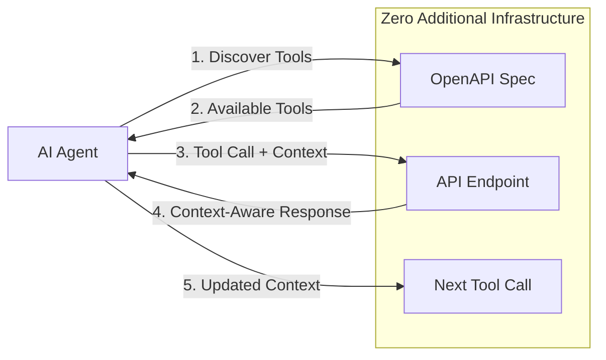

**TL;DR**: OCP enables persistent context sharing across HTTP API calls using standard headers, with automatic API discovery from OpenAPI specifications and optional community registry integration for fast tool discovery - no servers or infrastructure required.

---

## Problem & Solution Overview

### The AI Agent Integration Challenge

**Current Limitations**:
- Agents lose context between API calls
- Manual integration for each API service
- Complex server infrastructure for simple context passing
- No standard way to share conversation state
- Fragmented tooling across different APIs

**OCP's Solution**:
- ✅ **Context Persistence**: HTTP headers carry conversation state across calls
- ✅ **API Discovery**: Auto-generate tools from OpenAPI specifications
- ✅ **Community Registry**: Fast API discovery from pre-indexed specifications (optional)
- ✅ **Zero Infrastructure**: No servers, just standard HTTP headers
- ✅ **Standards-Based**: Built on HTTP, OpenAPI, and JSON
- ✅ **Immediate Compatibility**: Works with existing APIs today

### Core Capabilities

**What OCP Provides**:
- Persistent context across tool calls
- Automatic API discovery from OpenAPI specs
- Optional community registry for fast tool discovery
- Parameter validation and request building
- Session tracking and interaction history
- Framework-agnostic integration

**What OCP Doesn't Require**:
- New servers or infrastructure
- API modifications (Level 1 compatibility)
- Custom protocols or message formats
- Complex authentication systems

### The Agent Tool Flow:


**Key Insight**: Agents discover tools dynamically AND maintain context across calls.

---

## Protocol Specification

### HTTP Header Format

OCP uses standard HTTP headers to transmit context information:

**Required Headers**:
- `OCP-Context-ID`: Unique identifier for the agent session (max 64 chars, alphanumeric + hyphens)
- `OCP-Agent-Type`: Type of agent making the request (max 128 chars)

**Optional Headers**:
- `OCP-Agent-Goal`: Current agent objective (max 256 chars)
- `OCP-Session`: Base64-encoded compressed JSON context (max 8KB)
- `OCP-User`: User identifier (max 64 chars)
- `OCP-Workspace`: Current workspace/project (max 128 chars)

**Header Example**:
```http
OCP-Context-ID: ocp-a1b2c3d4
OCP-Agent-Type: ide_coding_assistant
OCP-Agent-Goal: debug_deployment_failure
OCP-User: alice
OCP-Workspace: payment-service
OCP-Session: eyJjb250ZXh0X2lkIjoib2NwLWExYjJjM2Q0IiwiYWdlbnRfdHlwZSI6ImlkZV9jb2RpbmdfYXNzaXN0YW50In0=
```

### Context Object Schema

The `OCP-Session` header contains a Base64-encoded, optionally compressed JSON object:

**Minimal Context** (Level 1 - Always Present):
```json
{
  "context_id": "ocp-a1b2c3d4",
  "agent_type": "ide_coding_assistant",
  "created_at": "2025-10-24T15:30:00Z",
  "last_updated": "2025-10-24T15:35:00Z"
}
```

**Extended Context** (Level 1 - Optional Fields):
```json
{
  "context_id": "ocp-a1b2c3d4",
  "agent_type": "ide_coding_assistant", 
  "user": "alice",
  "workspace": "payment-service",
  "current_goal": "debug_deployment_failure",
  "session": {
    "interaction_count": 5,
    "last_api_call": "github.listRepositoryIssues"
  },
  "history": [
    {
      "timestamp": "2025-10-24T15:30:00Z",
      "action": "api_call",
      "api": "github",
      "operation": "listRepositoryIssues",
      "result": "success"
    }
  ],
  "created_at": "2025-10-24T15:30:00Z",
  "last_updated": "2025-10-24T15:35:00Z"
}
```

### Encoding Rules

1. **JSON Serialization**: Context must be valid UTF-8 JSON
2. **Compression**: Optional gzip compression before Base64 encoding
3. **Base64 Encoding**: Standard Base64 encoding (RFC 4648)
4. **Size Limits**: Maximum 8KB for `OCP-Session` header after encoding

### Error Handling

**Invalid Context**: APIs should ignore invalid OCP headers and process requests normally

**Oversized Context**: Headers exceeding limits should be truncated or ignored

**Missing Context**: APIs work normally without OCP headers (backward compatibility)

### Security Considerations

- **No Sensitive Data**: Never include passwords, tokens, or secrets in context
- **Size Limits**: Enforce header size limits to prevent abuse
- **Logging**: Consider context privacy when logging HTTP requests
- **Validation**: Validate context structure but don't fail requests on invalid context

### API Compatibility Levels

**Level 1 - Context Aware (Available Today)**:
- API receives OCP headers but doesn't modify behavior
- Client-side context management only
- Works with any existing HTTP API

**Level 2 - Context Enhanced (Future)**:
- API reads OCP context and provides enhanced responses
- Requires API-side OCP implementation
- Optional OpenAPI extensions for behavior specification

---

## Core OCP Components

OCP consists of two fundamental capabilities that work together:

### 1. **Context Management** (Header-Based)
Smart context injection into existing HTTP APIs using standard headers. Enables persistent conversation state and session tracking across API calls.

### 2. **Schema Discovery** (OpenAPI-Based)  
Automatic API tool discovery and invocation from OpenAPI specifications. Converts any OpenAPI-documented API into callable tools with parameter validation.

**Together**: Context + Discovery = Complete agent-ready API integration with zero infrastructure.

---

## Schema Discovery: API Tool Generation

### Automatic Tool Discovery from OpenAPI
OCP automatically converts OpenAPI specifications into callable tools for AI agents:

```python
from ocp_agent import OCPAgent

# Create agent with context
agent = OCPAgent(
    agent_type="api_explorer",
    workspace="my-project"
)

# Register GitHub API (auto-discovers tools)
api_spec = agent.register_api('github', 'https://api.github.com/rest/openapi.json')

# List available tools
tools = agent.list_tools('github')
print(f"Discovered {len(tools)} tools")

# Search for specific tools
issue_tools = agent.search_tools('create issue')

# Call tools with automatic context injection
response = agent.call_tool('createIssue', {
    'owner': 'myorg',
    'repo': 'myproject', 
    'title': 'Bug found in payment flow',
    'body': 'Discovered during debugging session'
})
```

### Tool Schema Generation
Each OpenAPI operation becomes a callable tool with full parameter validation:

```python
# Tool generated from OpenAPI operation
{
    'name': 'createIssue',
    'description': 'Create an issue',
    'method': 'POST',
    'path': '/repos/{owner}/{repo}/issues',
    'parameters': {
        'owner': {'type': 'string', 'required': True, 'location': 'path'},
        'repo': {'type': 'string', 'required': True, 'location': 'path'},
        'title': {'type': 'string', 'required': True, 'location': 'body'},
        'body': {'type': 'string', 'required': False, 'location': 'body'},
        'labels': {'type': 'array', 'required': False, 'location': 'body'}
    },
    'response_schema': {...}  # OpenAPI response schema
}
```

### Deterministic Tool Naming
OCP ensures predictable tool names for consistent agent behavior:

```python
# Tool naming follows deterministic rules:
# 1. Use operationId when present in OpenAPI spec
{
    "operationId": "listRepositories",  # → Tool name: "listRepositories"
    "operationId": "createIssue"        # → Tool name: "createIssue"
}

# 2. Generate from HTTP method + path when operationId missing
{
    "GET /items":     # → Tool name: "get_items"
    "POST /items":    # → Tool name: "post_items"  
    "GET /items/{id}" # → Tool name: "get_items_id"
}

# This ensures:
# - Agents can reliably reference tools across sessions
# - Tool names remain consistent across API spec updates
# - Integration scripts don't break due to name changes
```

---

## Community Registry Integration

### Fast API Discovery with Pre-indexed Specifications

For improved performance and developer experience, OCP supports integration with community registries that maintain pre-discovered and validated API specifications. This enables instant tool discovery instead of parsing OpenAPI specs on every request.

### Registry-First Discovery

```python
from ocp_agent import OCPAgent

# Agent automatically uses registry for fast lookup
agent = OCPAgent(
    agent_type="api_explorer",
    registry_url="https://registry.ocp.dev"  # Optional, defaults to env var
)

# Fast registry lookup (50ms vs 2-5 seconds for OpenAPI parsing)
api_spec = agent.register_api('github')  # No OpenAPI URL needed

# Fallback to direct OpenAPI if not in registry
api_spec = agent.register_api('custom-api', 'https://api.example.com/openapi.json')

# Registry integration with base URL override
api_spec = agent.register_api('github', base_url='https://enterprise.github.com/api/v3')
```

### Registry Benefits

**Performance**: 
- Registry lookup: ~50ms response time
- Direct OpenAPI parsing: 2-5 seconds depending on spec size
- Significant improvement for agent startup and tool discovery

**Reliability**:
- Pre-validated API specifications
- Consistent tool naming across versions
- Cached and optimized for fast access

**Developer Experience**:
- Typo detection with suggestions
- Searchable API catalog
- Base URL override for different environments

**Backward Compatibility**:
- Seamless fallback to direct OpenAPI URLs
- No breaking changes to existing code
- Optional enhancement, not requirement

---

## OpenAPI Integration Levels

### Level 1: Standard OpenAPI (Works Today)
OCP works immediately with any existing OpenAPI specification:

```python
from ocp_agent import OCPAgent

# Works with GitHub's existing OpenAPI spec
agent = OCPAgent(
    agent_type="api_client",
    user="alice"
)
agent.register_api('github', 'https://api.github.com/rest/openapi.json')

# All GitHub API operations become available as tools
response = agent.call_tool('listUserRepos', {'username': 'octocat'})
```

### Level 2: OCP-Enhanced OpenAPI (Future)

> **Note**: The following features require API provider adoption and are not available today. Level 1 OCP (above) works with any existing API immediately.

APIs can optionally add OCP extensions to their OpenAPI specs to provide context-aware responses:

```yaml
# Enhanced GitHub OpenAPI spec (future)
openapi: 3.0.0
info:
  title: GitHub API
  version: 3.0.0
  x-ocp-enabled: true              # This API can read OCP context

paths:
  /repos/{owner}/{repo}/issues:
    post:
      summary: Create an issue
      x-ocp-context:                # OCP behavior for this operation
        enhances_with:
          - agent_goal              # Use agent goal to customize response
          - workspace_context       # Use workspace info for smarter defaults
          - conversation_history    # Use chat history for better issue descriptions
      responses:
        201:
          description: Issue created
          x-ocp-enhanced-response:  # What gets added when OCP context is present
            properties:
              suggested_labels:     # Auto-suggest labels based on context
                type: array
              related_issues:       # Find related issues based on context
                type: array
              next_actions:         # Suggest follow-up actions
                type: array
```

---

## Client Library Design Philosophy

**Protocol-Only Specification**: This specification defines the HTTP protocol layer only. OCP focuses on standardizing how context flows between agents and APIs via HTTP headers, not how client libraries should be structured.

**Core Requirements**: All OCP client libraries must provide:
1. **Context Management**: Create, update, and inject OCP context headers
2. **Schema Discovery**: Parse OpenAPI specs and generate callable tools
3. **Tool Invocation**: Execute API operations with automatic context injection
4. **Parameter Validation**: Validate tool parameters against OpenAPI schemas

**Language-Idiomatic Implementations**: Client libraries should follow idiomatic patterns for their respective languages while correctly implementing the OCP HTTP protocol. This approach:

- Enables **natural APIs** for each programming language
- Encourages **innovation** in client design patterns  
- Reduces **adoption friction** by feeling familiar to developers
- Ensures **interoperability** through the shared HTTP protocol

**What Must Be Consistent**:
- HTTP header format (`OCP-Context-ID`, `OCP-Session`, etc.)
- Context object JSON schema
- Base64 encoding and compression rules
- OpenAPI parsing and tool generation
- Tool invocation parameter mapping

## Detailed Protocol References

For complete implementation details, see the protocol specification subsections:








- **Context Serialization**: 100% test coverage for encoding/decoding
- **Tool Generation**: Deterministic naming and parameter extraction
- **HTTP Integration**: Header injection and response parsing
- **OpenAPI Parsing**: Handle malformed specifications gracefully

### Performance Standards
- **Tool Discovery**: Cache OpenAPI specifications locally
- **Context Compression**: Compress contexts >1KB before encoding
- **Memory Efficiency**: Handle large API specifications without excessive memory
- **Network Optimization**: Minimize redundant specification downloads

## Version Compatibility

### Current Version: OCP 2.0

**Breaking Changes from 1.0:**
- Agent-focused header naming (`OCP-Agent-*` prefix)
- Simplified context schema with required/optional field distinction
- Enhanced OpenAPI tool generation with deterministic naming

**Backward Compatibility:**
- OCP 1.0 headers supported in transition period
- Graceful fallback for unsupported features
- OpenAPI 2.0 specifications supported with limitations

### Future Versioning
- **Semantic Versioning**: Major.Minor.Patch format
- **Specification Stability**: Backward compatibility within major versions  
- **Implementation Guidelines**: Clear migration paths for breaking changes

## Reference Implementations

### Production Libraries
- **Python**: [`ocp-python`](https://github.com/opencontextprotocol/ocp-python) - Reference implementation
- **JavaScript**: [`ocp-javascript`](https://github.com/opencontextprotocol/ocp-javascript) - 1:1 parity with Python
- **CLI**: [`ocp-cli`](https://github.com/opencontextprotocol/ocp-cli) - Command-line tools and validation

### Validation Tools
- **Specification Validator**: Validate OCP compliance
- **Context Schema Validator**: JSON schema validation
- **OpenAPI Compatibility Checker**: Verify tool generation
- **Performance Benchmarks**: Reference performance metrics