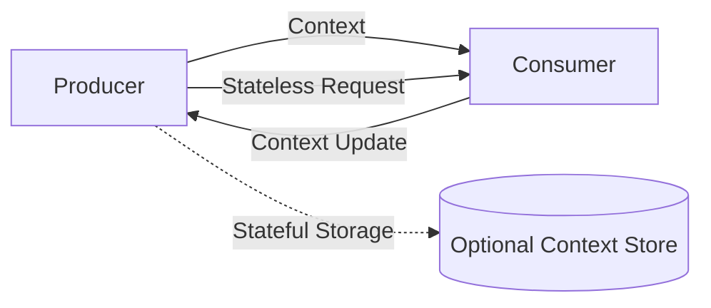

The Open Context Protocol (OCP) provides a standardized mechanism for AI applications to exchange, manage, and persist context without requiring dedicated infrastructure. OCP is transport-agnostic, enabling seamless context management across different workflows.

Unlike traditional client-server models, OCP operates on a stateless-first principle. Applications can pass context inline within requests, removing the need for persistent storage. For cases requiring context persistence, OCP defines an optional storage mechanism where context can be referenced by an identifier.

## Core Components

OCP consists of the following components:

- Producers – Generate or modify context.
- Consumers – Receive and use context for processing.
- Transports – Define how context moves between producers and consumers.

OCP does not mandate a specific architecture—implementations can integrate it into existing systems without requiring a central server.



## Context Handling

OCP defines two primary modes of operation:
- Stateless Mode – Context is passed inline with each request, ensuring no external dependencies.
- Stateful Mode – Context is stored externally and referenced via a `context_id`.

Applications SHOULD use stateless mode where possible, as it reduces complexity and eliminates the need for additional infrastructure.

## Context Model

OCP defines a context object as a structured data format that encapsulates relevant information for AI-driven interactions.

### Context Object Structure

An OCP context object consists of:
- `context_id` (string, required) – A unique identifier for the context instance.
- `metadata` (object, optional) – Implementation-specific metadata associated with the context.
- `session` (object, required) – Encapsulates conversation history and relevant AI state.
- `expires` (timestamp, optional) – Defines when the context MUST NOT be considered valid.

#### Example Context Object
```json
{
  "context_id": "123e4567-e89b-12d3-a456-426614174000",
  "metadata": {
    "application": "example-app",
    "user_id": "user-123"
  },
  "session": {
    "history": [
      { "role": "user", "message": "Summarize this document." },
      { "role": "assistant", "message": "Here's a summary..." }
    ]
  },
  "expires": "2025-03-16T12:00:00Z"
}
```

## Constraints

- Context Size Limits – Implementations SHOULD keep context sizes manageable to ensure efficient transport.
- Context Expiration – If `expires` is defined, applications MUST NOT use the context beyond its expiration time.
- Immutability – Clients MUST NOT modify an existing `context_id` but MAY create a new one for updates.

## Learn More

For further details, refer to:
- [Versioning](basic/versioning.md)
- [Lifecycle](basic/lifecycle.md)
- [Transports](basic/transports.md)
- [Security](basic/security.md)
