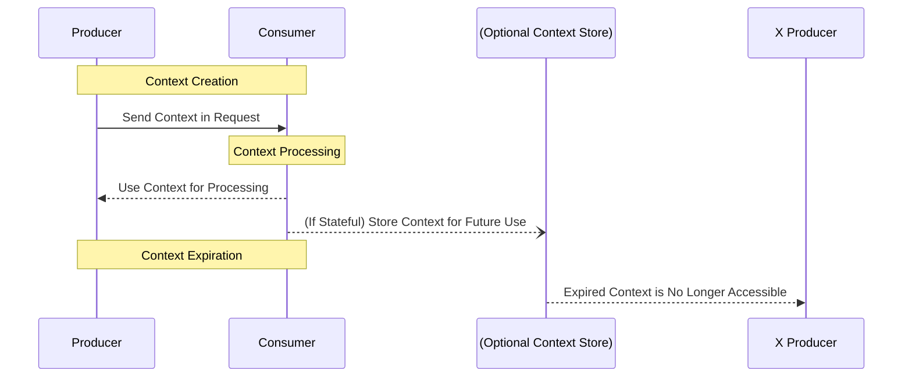

 Protocol Revision:  

The Open Context Protocol (OCP) defines a structured lifecycle for managing context.  
Contexts can be created, updated, passed between applications, and optionally stored  
for future retrieval.

OCP supports two primary lifecycle models:
- Stateless Mode: Context is included within each request and discarded afterward.
- Stateful Mode: Context is stored externally and referenced via `context_id`.

## Lifecycle Phases

OCP defines the following phases for a context object:

1. Creation – A new context object is initialized and associated with a request.
2. Propagation – The context is passed between applications via supported transports.
3. Update (Optional) – The context is modified, either in-memory or in persistent storage.
4. Expiration – The context is no longer valid and should be discarded.

## Context Creation

Context creation MUST occur at the beginning of an interaction. A new `context_id` MUST be generated when:
- A request starts a new interaction.
- An AI model session needs contextual continuity across multiple exchanges.

## Context Propagation

Contexts MAY be embedded within:
- HTTP headers (stateless transport).
- Inline JSON payloads (structured API calls).
- WebSockets/gRPC (real-time streaming).

## Context Updates

Context MAY be updated if the transport or storage mechanism allows modifications. However, full overwrites are required by default. Implementations MAY support partial updates via `PATCH`, but this is optional.

## Context Expiration

Contexts MAY specify an `expires` timestamp. If present, the context MUST NOT be used beyond the specified expiration time.

## Learn More

For further details, refer to:
- [Versioning](basic/versioning.md)
- [Transports](basic/transports.md)
- [Security](basic/security.md)