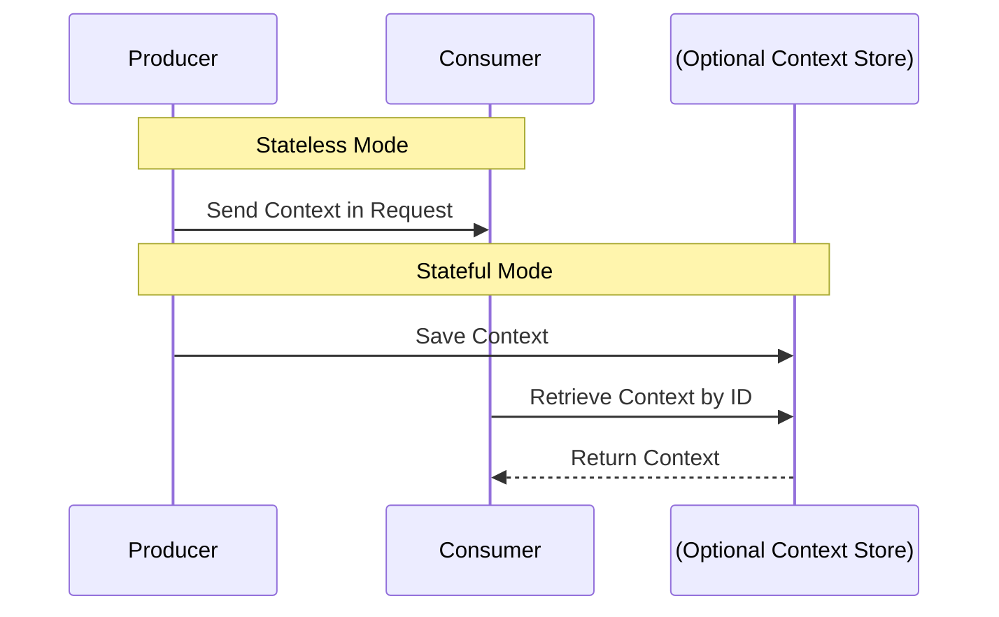

 Protocol Revision: draft 

OCP is transport-agnostic and can be used over multiple communication mechanisms.  
The protocol supports two primary transmission methods:

- Inline Context (Stateless Mode) – Context is passed directly in each request.
- Referenced Context (Stateful Mode) – Context is stored and referenced via `context_id`.

## Supported Transport Mechanisms

OCP defines the following transport mechanisms:

1. [HTTP](#http) – Context is passed in headers or request bodies.
2. [WebSockets](#websockets) – Context is sent as metadata in real-time interactions.
3. [gRPC](#grpc) – Context is transmitted via structured protocol messages.

Other transport methods MAY be implemented as needed.

## HTTP

In HTTP-based transports, context MAY be included in request headers or bodies:

- HTTP Headers (base64-encoded JSON):
  ```http
  OCP-Context: eyJjb250ZXh0X2lkIjoiMTIz... (encoded)
  ```
- HTTP Request Body:
  ```json
  {
    "context": {}
  }
  ```

For stored contexts, a client MAY retrieve a context via a GET request:
```http
GET /context/123e4567
Authorization: Bearer YOUR-API-KEY
```

## WebSockets

For WebSocket-based communication, context MAY be sent as metadata:
```json
{
  "event": "message",
  "context": {},
  "data": "User input text"
}
```

## gRPC

In gRPC, context MUST be included as a structured field in the request:
```protobuf
message Request {
  string context_id = 1;
  Context session = 2;
}
```

## Transport Flow

The following diagram illustrates how OCP handles stateless and stateful transmissions:


## Learn More

For further details, refer to:
- [Lifecycle](basic/lifecycle.md)
- [Messages](basic/messages.md)
- [Security](basic/security.md)